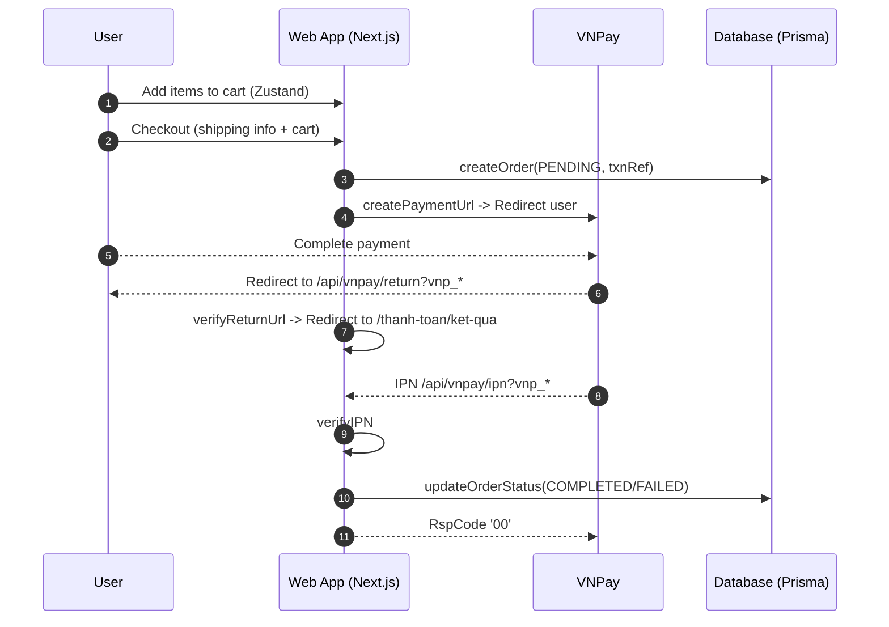

### ewYssBook – Application Workflow

This document provides a concise overview of the application architecture and the end‑to‑end workflow for browsing books, managing the cart, and completing checkout via VNPay.

## High‑level Architecture
- **Framework**: Next.js App Router (TypeScript)
- **Database/ORM**: PostgreSQL + Prisma (`prisma/schema.prisma`, client generated to `lib/generated/prisma`)
- **Auth**: Clerk (see `middleware.ts`, `lib/actions/users.ts`)
- **State Management**: Zustand for client cart (`hooks/use-cart.ts`) with localStorage persistence
- **Payments**: VNPay integration (`lib/vnpay.ts` and API routes under `app/api/vnpay/*`)

## Key Routes and Pages
- **Home**: `/` – lists books, category filter, search
  - Data fetchers in `lib/actions/get-books.ts` (`getAllBooks`, `getBooksByCategory`, `searchBooks`).
- **Book Detail**: `/sach/[slug]` – server component loads a single book by slug and renders client details (`components/BookDetailClient.tsx`).
- **Cart**: `/thanh-toan/gio-hang` – client cart page using Zustand store (`hooks/use-cart.ts`).
- **Payment Result**: `/thanh-toan/ket-qua` – shows payment outcome after VNPay redirects back.

## Client Cart Flow
- Store: `hooks/use-cart.ts` with `persist` middleware for localStorage.
- Core actions:
  - `addItem(bookId, version, title, slug, coverUrl, price, salePrice, maxQty, quantity?)`
  - `updateQuantity(itemId, quantity)` / `removeItem(itemId)` / `clearCart()`
  - Derived: `totalItems`, `totalPrice`, `recalculateTotals()`
- UI integrations: `components/CartModal.tsx`, `/thanh-toan/gio-hang/page.tsx` for editing quantities with debounced updates.

## Checkout + VNPay Flow
1) **Create Order & Payment URL**
   - Client collects shipping info and cart items, computes `amount` and generates a unique `txnRef`.
   - Calls `POST /api/vnpay/create-payment` with `{ amount, orderInfo, txnRef, bankCode?, shippingInfo, orderItems, userId }`.
   - Server:
     - Creates a PENDING order via `createOrder` in `lib/actions/orders.ts` (stores `transactionId = txnRef`).
     - Builds VNPay URL using `VNPayService.createPaymentUrl(...)` in `lib/vnpay.ts`.
     - Returns `{ paymentUrl }` for client redirect.

2) **Customer Pays at VNPay**
   - User is redirected to VNPay payment page.

3) **Customer Return (browser redirect)**
   - VNPay redirects user back to `GET /api/vnpay/return?vnp_*`.
   - Server verifies signature using `VNPayService.verifyReturnUrl(query)`.
   - Redirects user to `/thanh-toan/ket-qua` with `success`, `txnRef`, `amount`, `responseCode` in query string.
   - Optionally, client may call `POST /api/vnpay/verify-return` to validate return data again.

4) **Server‑to‑Server Confirmation (IPN)**
   - VNPay sends IPN to `GET /api/vnpay/ipn?vnp_*` (or POST equivalent handled by the same logic).
   - Server verifies signature with `VNPayService.verifyIPN(query)` and validates amount vs. order total.
   - Updates order via `updateOrderStatus` (`COMPLETED/CONFIRMED` on success, or `FAILED/CANCELLED` on failure).
   - Responds with `{ RspCode: '00', Message: 'Confirm Success' }` if processed successfully (per VNPay spec).

### Sequence Diagram

## Important Server Modules
- `lib/vnpay.ts`
  - Builds signed VNPay URLs, verifies return and IPN signatures.
  - Requires `VNPAY_TMN_CODE` and `VNPAY_HASH_KEY` environment variables.
- `lib/actions/orders.ts`
  - `createOrder(...)` persists PENDING orders and items.
  - `updateOrderStatus(...)` transitions payment and order status based on IPN.
- `lib/actions/get-books.ts`
  - Book listing, category filter, and search using Prisma `book` model.
- `lib/actions/users.ts`
  - Ensures a Clerk user exists in DB on authentication (`currentUser`).

## Database Models (Prisma)
- `User`, `Book`, `Coupon`, `Order`, `OrderItem` with enums: `PaymentMethod`, `PaymentStatus`, `OrderStatus`, `BookVersion`.
- `Order.paymentMethod` includes `VNPAY`. Order stores `transactionId` used to correlate with VNPay `vnp_TxnRef`.

## Environment Variables
- `DATABASE_URL`: PostgreSQL connection string
- `VNPAY_TMN_CODE`: VNPay terminal code
- `VNPAY_HASH_KEY`: VNPay secret key for signing
- `NEXT_PUBLIC_SITE_URL`: Base site URL used to compose return URLs
- Clerk (auth): typical keys like `NEXT_PUBLIC_CLERK_PUBLISHABLE_KEY`, `CLERK_SECRET_KEY` as per Clerk setup

## Operational Notes
- Ensure Prisma migrations are applied before running the app.
- IPN endpoint must be publicly reachable by VNPay with correct domain and TLS.
- Always trust order finality from IPN. The return URL is for UX; the authoritative status change happens on IPN.

